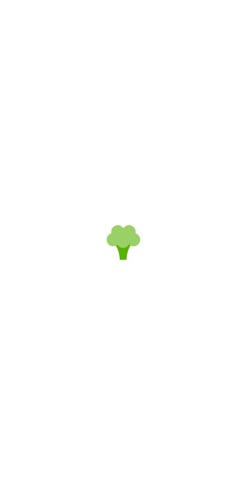
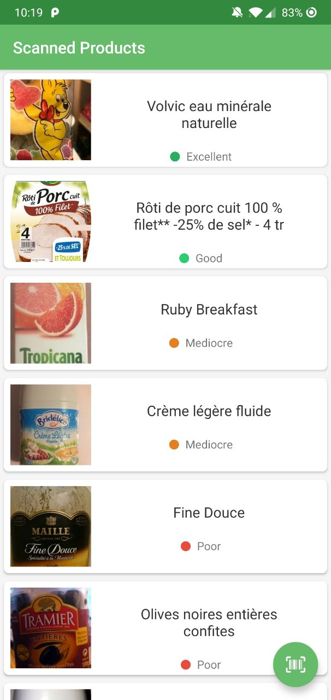
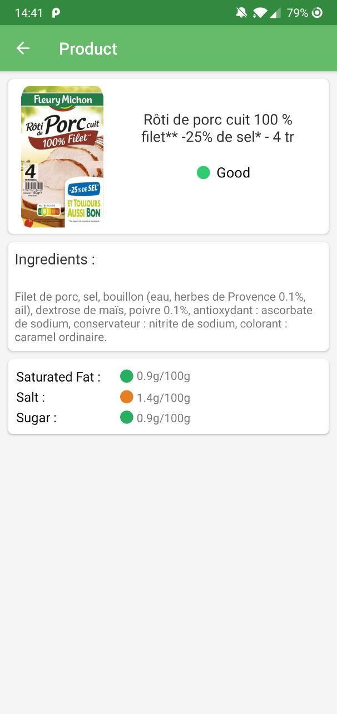
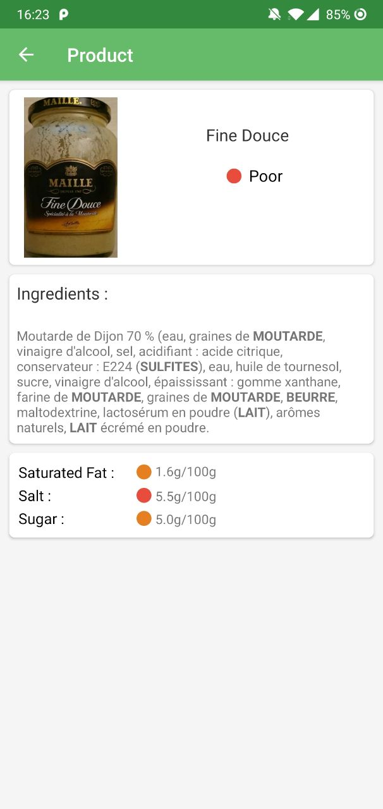
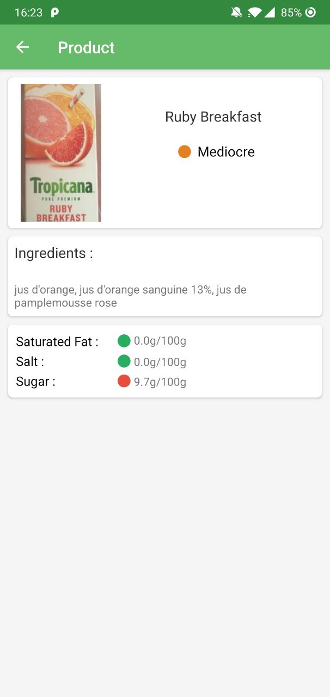
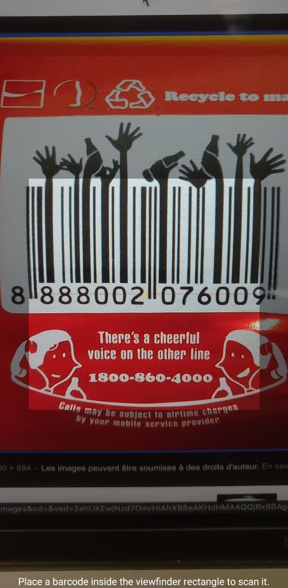

# HealthyCheck

HealthyCheck is an Android app who uses OpenFoodFacts' API to check if your food is healthy

## Installation
- `git clone https://github.com/yohanleb/HealthyCheck.git`

- Open project in Android Studio

## Features

- MVC Architecture
- REST API Call
- Singleton for API Instance
- 3 activities
- Displaying a list in a RecyclerView
- Displaying a detail view of the item
- Gitflow
- Animations between two views
- Data stored in cache
- More features : 
	- Scanner view
	- Material Cards
	- Splash Screen

### Splash Screen

The first screen is a loading screen with the HealthyCheck logo

### Scanned products list

You can view all your scanned products in the list

### Detailed view of a product
  

You can view the detail of a product by clicking on it in the list
This view shows the name of the product, the ingredients and the quantity of saturated fat, salt and sugar.

### Scanner

You can scan products by clicking on the scan button

### Animations
There are animations between two views

## Warning
The application is not a nutrionist. It can make errors so keep a critical eye.
The data showed belongs to OpenFoodFacts' API, the images or the names can be incorrect

## Used librairies
[Gson](https://github.com/google/gson)

[Retrofit](https://github.com/square/retrofit)

[RecyclerView](https://developer.android.com/guide/topics/ui/layout/recyclerview)

[Zxing](https://github.com/zxing/zxing)

[Picasso](https://square.github.io/picasso/)

## Inspirations

[Yuka](https://yuka.io/)

[OpenFoodFacts](https://github.com/openfoodfacts/openfoodfacts-androidapp)
